```mermaid
flowchart LR
  %% Color classes
  classDef ui fill:#E3F2FD,stroke:#1E88E5,stroke-width:2px,color:#0D47A1;
  classDef core fill:#E8F5E9,stroke:#43A047,stroke-width:2px,color:#1B5E20;
  classDef search fill:#FFF3E0,stroke:#FB8C00,stroke-width:2px,color:#E65100;
  classDef data fill:#F3E5F5,stroke:#8E24AA,stroke-width:2px,color:#4A148C;

  subgraph UI
    W["Web App<br/>React/Angular"]
    M["Mobile Web"]
  end
  class W,M ui;

  subgraph Core["Core Services"]
    API["Node API<br/>Auth • Content • Feeds"]
    MDB["MongoDB<br/>content, authors, taxonomy"]
  end
  class API,MDB core;

  subgraph Search["Search & Discovery"]
    IDX["Indexer<br/>queue/stream"]
    ES["Elasticsearch<br/>articles, autocomplete"]
  end
  class IDX,ES search;

  subgraph Data["Data Lake & Analytics"]
    S3["AWS S3<br/>raw/ • bronze/ • silver/"]
    DL["Delta Lake<br/>batch + streaming"]
    NLP["NLP Tagger<br/>topics • entities"]
  end
  class S3,DL,NLP data;

  W -->|HTTPS| API
  M -->|HTTPS| API
  API --> MDB
  API --> IDX
  IDX --> ES
  API --> S3
  S3 --> DL
  DL --> NLP
  NLP --> ES
```

# 📰🔍 Zee Media — Internship Case Study (Summary)

> **Timeline:** May–Sep 2022  
> **Note:** Sanitized summary. **No proprietary code.** Full story lives on my portfolio.

---

## Overview
A nationwide news platform with **responsive UI**, **fast search**, and **personalized** content across devices.

**Stack (representative):** React (primary), Angular (legacy), Node.js, MongoDB, Elasticsearch, AWS S3 + Delta Lake, CI/CD (GitHub Actions/Jenkins).

---

## Highlights
- **~25% engagement lift** after responsive redesign.
- **Faster search** via ES mappings & indexing strategy.
- **~20% fewer deployment errors** after CI/CD automation (canary + rollback).

> Evidence available on request (redacted). Metrics reflect team outcomes during my internship period.

---

## Architecture (High Level)

---

## Tech Notes (1‑pager)
- **Indexing & Search:** multi-match (`title^2`, `body`), filters (`section`, `publishedAt`), autocomplete index; idempotent indexer.
- **Personalization/NLP:** ES MLT + TF‑IDF/embeddings; NLP tagging for topics/entities feeding search & recirculation.
- **Data Lake:** S3 tiered (`raw/`, `bronze/`, `silver/`), Delta Lake for ACID; batch + streaming jobs.
- **CI/CD:** Dockerized services; GH Actions/Jenkins; canary + rollback; IaC for reproducible envs.

---

## Full Case Study
👉 **Read the full write‑up with diagrams & pseudocode:**  
https://manojtummala.github.io/work/zee-media

(If that link isn’t live yet, it will be shortly. Ask me for a private PDF deck.)