# 📰🔍 Zee Media — Content Delivery, Search & Personalization (Internship Case Study)
Work done during my internship at Zee Media.
> **Internship:** May–Sep 2022  
> **Note:** This is a **sanitized case study**. It documents the system and decisions with diagrams, schema samples, and pseudocode. **No proprietary code** is included.

<p align="center">
  <a href="#overview">Overview</a> •
  <a href="#highlights">Highlights</a> •
  <a href="#architecture">Architecture</a> •
  <a href="#publish-%E2%86%92-index-%E2%86%92-search-sequence">Publish → Index → Search</a> •
  <a href="#indexing--search">Indexing & Search</a> •
  <a href="#personalization--nlp">Personalization & NLP</a> •
  <a href="#data-lake--analytics">Data Lake & Analytics</a> •
  <a href="#cicd--ops">CI/CD & Ops</a> •
  <a href="#what-id-do-now">What I’d do now</a>
</p>

---

## Overview

A nationwide news platform delivering **responsive** web experiences, **fast search**, and **personalized** content across devices.

**Stack (representative):** React (primary), Angular (legacy surfaces), Node.js, MongoDB, Elasticsearch, AWS S3 + Delta Lake, CI/CD (GitHub Actions/Jenkins), WebSockets (proposal).

---

## Highlights

- **+25% engagement** after responsive redesign across device classes.
- **Search latency reduced** via Elasticsearch mappings & indexing strategy improvements.
- **~20% fewer deployment errors** after CI/CD automation with canary + rollback.

> Evidence available on request (redacted screenshots/notes). Metrics are approximate and reflect team outcomes during my internship period.

---

## Architecture

```mermaid
flowchart LR
  %% Color classes
  classDef ui fill:#E3F2FD,stroke:#1E88E5,stroke-width:2px,color:#0D47A1;
  classDef core fill:#E8F5E9,stroke:#43A047,stroke-width:2px,color:#1B5E20;
  classDef search fill:#FFF3E0,stroke:#FB8C00,stroke-width:2px,color:#E65100;
  classDef data fill:#F3E5F5,stroke:#8E24AA,stroke-width:2px,color:#4A148C;

  subgraph UI
    W["Web App<br/>React/Angular"]
    M["Mobile Web"]
  end
  class W,M ui;

  subgraph Core["Core Services"]
    API["Node API<br/>Auth • Content • Feeds"]
    MDB["MongoDB<br/>content, authors, taxonomy"]
  end
  class API,MDB core;

  subgraph Search["Search & Discovery"]
    IDX["Indexer<br/>queue/stream"]
    ES["Elasticsearch<br/>articles, autocomplete"]
  end
  class IDX,ES search;

  subgraph Data["Data Lake & Analytics"]
    S3["AWS S3<br/>raw/ • bronze/ • silver/"]
    DL["Delta Lake<br/>batch + streaming"]
    NLP["NLP Tagger<br/>topics • entities"]
  end
  class S3,DL,NLP data;

  W -->|HTTPS| API
  M -->|HTTPS| API
  API --> MDB
  API --> IDX
  IDX --> ES
  API --> S3
  S3 --> DL
  DL --> NLP
  NLP --> ES
```



---

## Publish → Index → Search (Sequence)


---

## Indexing & Search

### Elasticsearch mapping (simplified)
```json
{
  "mappings": {
    "properties": {
      "id": { "type": "keyword" },
      "title": { "type": "text", "analyzer": "standard" },
      "body": { "type": "text" },
      "tags": { "type": "keyword" },
      "authors": { "type": "keyword" },
      "publishedAt": { "type": "date" },
      "section": { "type": "keyword" }
    }
  }
}
```

### Indexer (pseudocode)
```python
def index_article(doc):
    doc["searchBoost"] = compute_boost(doc)
    es.index(index="articles", id=doc["id"], body=doc)
```

### Query patterns
- Multi-match on `title`, `body` (e.g., `title^2` boost).
- Filters on `section`, `publishedAt`.
- **Autocomplete** index for typeahead suggestions.

---

## Personalization & NLP

- **Content-based** recommendations: ES “more like this” + TF‑IDF/embeddings.
- **Trending** signals: views, dwell time, shares.
- **NLP tagging** (topics/entities) improves retrieval and recirculation.

```python
def tag_article(text):
    topics = topic_model(text)      # category/topic labels
    ents = ner_model(text)          # named entities
    return {"topics": topics, "entities": ents}
```

---

## Data Lake & Analytics

- **S3** tiered layout: `raw/` (ingest), `bronze/` (clean), `silver/` (modeled).
- **Delta Lake** for ACID on lake tables; batch + streaming jobs.
- KPI dashboards: traffic, CTR, recirculation, search success.

---

## CI/CD & Ops

- Dockerized services; GitHub Actions/Jenkins pipelines (build → test → deploy).
- **Canary releases** and **automatic rollback**.
- **Infrastructure as Code** (Terraform/CloudFormation) for reproducible envs.

---

## What I’d do now

- Add a lightweight **feature store** for personalization features.
- Switch to **incremental indexing** (CDC) for fresher search.
- Roll out **WebSockets** for instant publish notifications.

---

> This document summarizes my internship work in a vendor-neutral, non‑confidential way. For deeper details, I can share a private appendix (redacted) upon request.